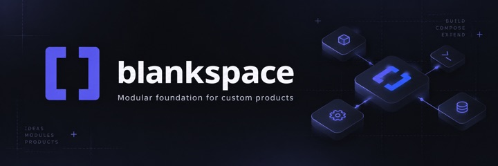

# Blankspace

[](https://github.com/CaryK753/BlankSpace/actions/workflows/s2-conformance.yml)
[](https://github.com/CaryK753/BlankSpace/actions/workflows/s3-conformance.yml)
[](https://github.com/CaryK753/BlankSpace/actions/workflows/s4-conformance.yml)
[](LICENSE)

Blankspace 是一个不会因为产品定制而失去上游更新能力的模块化应用底座。它把可持续升级的框架能力与产品自己的业务、界面和数据分开，让开发者可以从同一个稳定 core 连续构建多个产品。

> [!IMPORTANT]
> 当前仓库处于 **Phase 1A spike**，不是可用的 SaaS starter，也不能用于生产。这里已经有可执行的 Contracts、Compiler 与 conformance experiments，但还没有 CLI、Web/Server 应用、Identity/Database Kits 或部署系统。

## 为什么做 Blankspace

传统模板通常在第一次生成后就变成产品自己的代码。定制越深，上游的安全修复、基础设施改进和兼容升级越难合并。Blankspace 选择另一条边界：

```text
Product Overlay
产品业务 / UI / 数据 / Coordinators / 品牌
        │
        ▼
Optional Kits
Identity / Workspace / Files / Editor / Billing / ...
        │
        ▼
Foundation
Contracts / Compiler / Runtime / Diagnostics / Tooling
```

- 产品主要修改 Product Overlay，不 fork 框架内部源码；
- Compiler 生成可检查的 Product Graph 与 Executable Registry；
- Runtime 只消费已验证记录，不在生产启动时重新猜测依赖；
- Kits 通过明确的 Service、Event、Adapter 和生命周期组合；
- 升级必须用真实 downstream fixtures 证明，而不是只提供更新说明。

首要产品指标是 **Upgrade Success Rate**：真实下游项目升级 Blankspace 后，无需修改声明过的 Product Overlay 业务代码即可通过构建、测试和运行验证的比例。

## 当前进度

机器可读状态以 [`docs/status/project-status.json`](docs/status/project-status.json) 为准。

| 区域 | 当前证据 | 状态 |
| --- | --- | --- |
| S1 Config | Node.js 24、Vitest、TypeScript、Ajv、跨目录 canonical hash | Provisional pass |
| S2 Resolver | TypeScript、Node、Vite、Vitest 原生解析对账；Linux/macOS/Windows 双 checkout、双 store | Pass |
| S3 Bundle trace | JS、CSS、worker、WASM、asset、virtual module 的跨平台 canonical trace | Pass |
| S4 Registry | Graph/Registry joint identity、Service/Event bindings、18 组 mismatch、entry side-effect probe | Pass |
| S5 Lifecycle | 生命周期 core、稳定 Event handler、嵌套深度限制和 dispatch 排空的 macOS 证据 | Provisional pass |

当前唯一 ready 工作项是 `A1-S5-03`：在 Linux、macOS、Windows 对账冻结的 S5 lifecycle/Event corpus。详见 [`docs/agent-start-here.md`](docs/agent-start-here.md)。

## 当前可运行内容

### `@blankspace/contracts`

提供正式 JSON Schema 与 TypeScript contracts，包括配置、Module、Product Graph、Resolution Record 与 Executable Registry。

### `@blankspace/compiler`

提供严格 JSONC/canonicalization、最小内存 Product Graph builder、workspace package/relative ESM resolver，以及 target 与 dynamic import policy。

### 风险实验

`spikes/` 中的 S1～S5 runners 负责把解析、bundle、Registry 和生命周期假设转化为可重现证据。它们不是生产 Runtime。

完整范围见[当前实现参考](docs/current-implementation.md)。

## 开发与验证

要求 Node.js 24 和 pnpm 10.32.1：

```bash
fnm exec --using=24 pnpm install --frozen-lockfile
fnm exec --using=24 pnpm build
fnm exec --using=24 pnpm typecheck
fnm exec --using=24 pnpm test
fnm exec --using=24 pnpm verify:docs
```

贡献者开始工作前必须阅读 [`AGENTS.md`](AGENTS.md) 和 [Agent 启动入口](docs/agent-start-here.md)。只领取 `phase-1a-work-items.json` 中唯一 `ready` 的工作项，不从远期路线图自行扩展范围。

## 路线

```text
Phase 1A  Assembly
Contracts → Graph → Registry → Lifecycle

Phase 1B  Product
Identity + Database + Product principal + Reference SaaS

Phase 1C  Compatibility
Product Shell + Extension Contract + Upstream Upgrade Proof

Adopter Preview
Launch Recipes + Preview Deployment + External Journeys
```

Phase 2 之后再推进 Local Workspace、Cloud migration、离线复制与协作。多客户端 Runtime、Editor、Billing、AI 等能力只能依据真实产品需求和独立 conformance evidence 晋级。

详见[开发路线图](docs/roadmap.md)与 [SaaS MVP 采用策略](docs/mvp-adoption.md)。

## 文档入口

- [当前实现与限制](docs/current-implementation.md)
- [完整文档索引](docs/README.md)
- [总体架构](docs/architecture.md)
- [Phase 1 实施蓝图](docs/phase-1-blueprint.md)
- [风险实验状态](docs/spikes/README.md)
- [开发者体验](docs/developer-experience.md)
- [品牌与视觉基线](docs/brand.md)
- [上游升级与兼容性](docs/upgrades.md)
- [安全与供应链](docs/security.md)
- [Production Readiness Gate](docs/production-readiness.md)

## 品牌资源


- Logo：[`docs/assets/brand/blankspace-logo.jpeg`](docs/assets/brand/blankspace-logo.jpeg)
- README 封面：[`docs/assets/brand/blankspace-readme-cover.jpeg`](docs/assets/brand/blankspace-readme-cover.jpeg)

当前资源是品牌基线，不代表完整视觉系统已经冻结。后续 Web/UI Shell 会在 S8 与 Phase 1C 中用真实界面、可访问性和视觉回归证据继续验证。

## License

Blankspace 使用 [GNU Affero General Public License v3.0](LICENSE)。第三方依赖、集成与分发仍需遵守[软件供应链政策](docs/supply-chain.md)。
